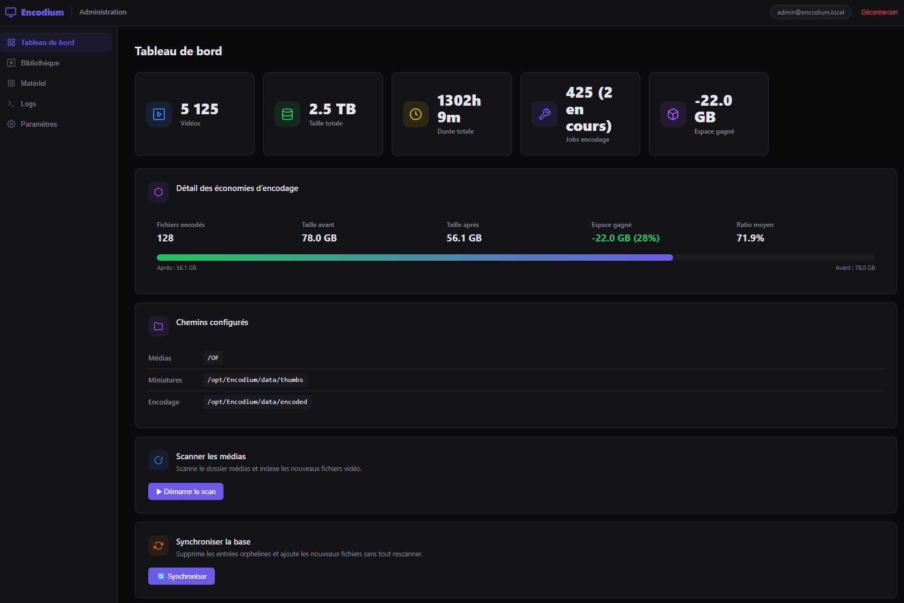
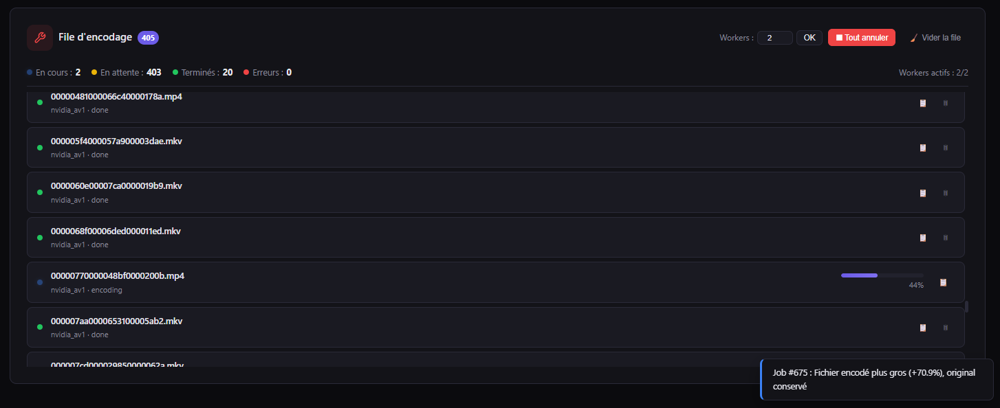
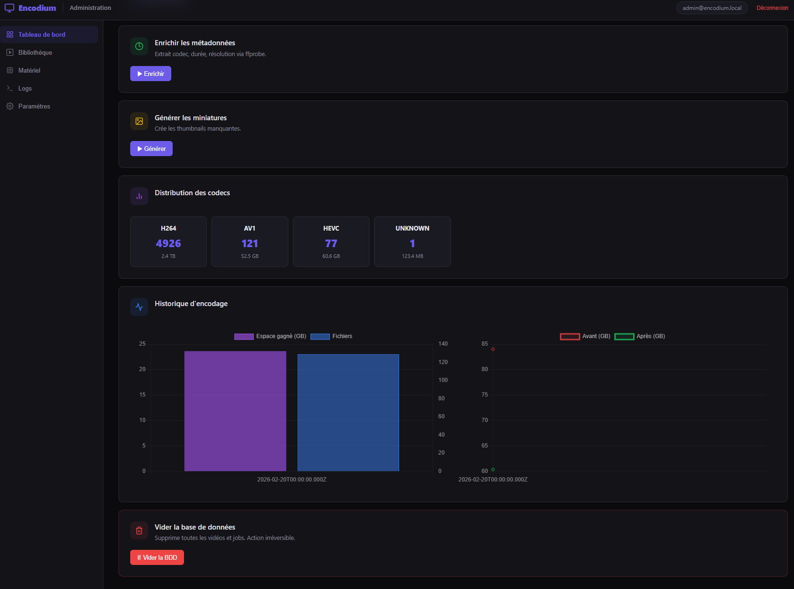
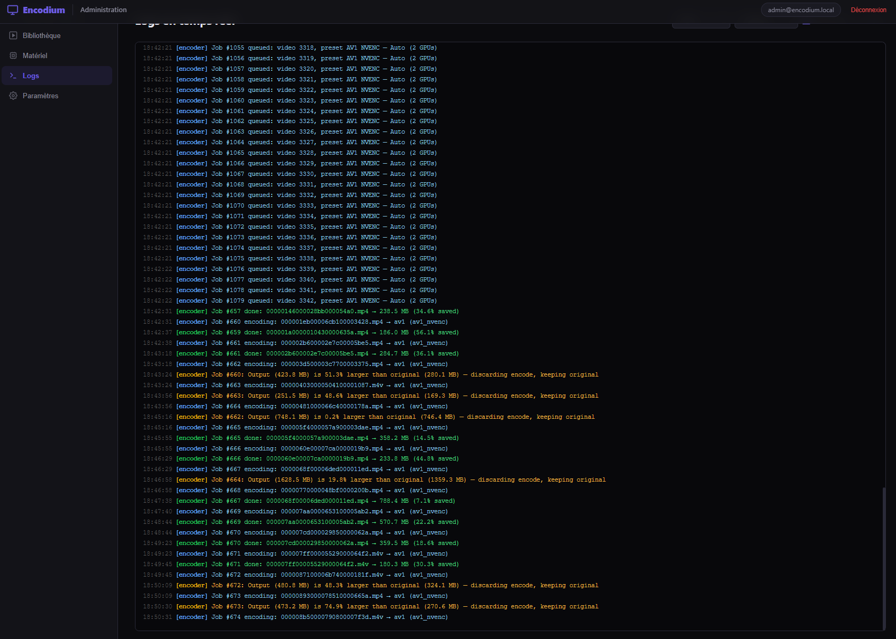

# Encodium

**Video Encoding Platform** — A standalone web application for scanning, browsing, and batch-encoding video files using hardware-accelerated (GPU) or CPU encoders.

   

## Screenshots

| Library & Dashboard | Encoding Queue |
|---|---|
|  |  |

| Library (alternate view) | Logs |
|---|---|
|  |  |

## Features

### Core
- **Multi-Source Media Library** — Add multiple source directories via a built-in file browser UI; fully DB-backed
- **Auto-Scan & Sync** — Real-time file watchers (`fs.watch`) + configurable periodic sync (5 / 15 / 30 / 60 / 360 min); no manual scan needed
- **Video Library** — Browse, search, filter by filename, folder, codec, resolution, size, duration, and skip status
- **Video Streaming** — HTML5 player with HTTP range-request support, directly from the UI
- **Hardware Detection** — Auto-detects NVIDIA NVENC, AMD/Intel VA-API, Intel QSV, and CPU encoders
- **Batch Encoding** — Select multiple videos, encode with H.265/HEVC or AV1 using detected presets
- **Multi-GPU Support** — Automatic load-balanced distribution across multiple GPUs
- **Metadata Enrichment** — Automatic ffprobe extraction of codec, resolution, duration, HDR, audio info
- **Thumbnail Generation** — On-demand thumbnail generation when browsing the library (non-blocking, generated in background with shimmer skeleton placeholder)

### Encoding Engine
- **Size Guard** — Rejects encodes that are larger than the original, keeping the source intact
- **Skip Flag** — Videos where encoding produced a larger file are flagged to prevent re-encoding; filter by skip status in the library; force re-encode from UI
- **HDR Preservation** — 10-bit/HDR10 color metadata detection and passthrough
- **HDR → SDR Tonemapping** — Optional zscale-based tonemap filter chain
- **Dolby Vision Protection** — Skips DV files to avoid data loss
- **Container Choice** — MKV, MP4, or automatic (MKV for AV1)
- **Downscale Presets** — 1080p, 720p, 480p output resolution options
- **GPU → CPU Fallback** — Automatic retry with software decode on hwaccel failure
- **Output Validation** — Checks codec, duration, file integrity after every encode
- **Per-job Logs** — Detailed ffmpeg logs for every encoding job, accessible from UI
- **Crash Recovery** — Stalled jobs automatically re-queued on server restart; orphan ffmpeg processes killed; stale temp files cleaned up

### Queue & Scheduling
- **Queue Management** — Configurable worker count (1–8), cancel/retry/delete jobs
- **Job Priority & Reorder** — Move jobs up/down in the queue
- **Clear Queue** — Remove finished/errored/cancelled jobs from the queue
- **Server-side Queue Counts** — Accurate encoding/pending/done counts via SQL aggregation, even with 10,000+ jobs
- **Schedule Window** — Restrict encoding to a daily time window
- **Persistent Savings** — Encoding savings tracked in a permanent ledger (survives queue clears and rescans)

### Presets & Notifications
- **Custom Presets** — Create reusable encoding presets (codec, CQ, container, downscale, tonemap)
- **Webhook Notifications** — Discord and generic HTTP webhook at queue completion

### UI & Monitoring
- **Real-time Updates** — SSE-powered live progress for encoding jobs, pipeline status, and log streaming; dashboard auto-refreshes when scans complete
- **Stats Dashboard** — Video count, total size, duration, codec distribution, encoding savings
- **Encoding Charts** — Daily savings history and before/after size comparison (Chart.js)
- **File Browser** — Server-side directory browser for adding media source directories (admin only)
- **Shift-click Range Selection** — Select multiple videos at once with Shift+click
- **Select All (filtered)** — Select all videos matching the current search/filter across all pages
- **Truncated Pagination** — Smart pagination with ellipsis for large libraries
- **Dark Theme** — Responsive single-page application
- **Internationalization** — 14 languages (EN, FR, DE, ES, IT, PT, NL, PL, RU, TR, AR, JA, KO, ZH)
- **Authentication** — JWT-based login with admin/member roles

## Requirements

- **Node.js** 18+ (20 LTS recommended)
- **MariaDB** 10.6+ or MySQL 8+
- **ffmpeg** 6+ with ffprobe
- Optional: NVIDIA GPU with drivers + NVENC, or VA-API/QSV hardware

## Quick Start

### Bare metal (recommended)

```bash
git clone https://github.com/HeartBtz/Encodium.git
cd Encodium
bash install.sh
```

The install script handles **everything**: Node.js (via nvm), MariaDB, ffmpeg, npm dependencies, database creation, `.env` configuration, admin account, PM2 + systemd service.

After install, open **http://localhost:4000**, log in with `admin@encodium.local / admin`, and add your media directories via **Settings → Sources**.

### Docker

```bash
git clone https://github.com/HeartBtz/Encodium.git
cd Encodium

# Create .env with at least DB_PASS and JWT_SECRET
cp .env.example .env
# Edit .env → set DB_PASS, JWT_SECRET

docker compose up -d                         # CPU only
docker compose --profile gpu up -d           # NVIDIA GPU
docker compose exec encodium node cli.js useradd admin@example.com yourpassword
```

Open **http://localhost:4000**, log in, and add your media directories via **Settings → Sources**.

## Updating

```bash
cd /path/to/Encodium
git pull
bash install.sh
```

The install script is idempotent — it detects existing components, upgrades npm dependencies, and restarts PM2 with the latest `ecosystem.config.js` from the repo.

## Process Management

### PM2 (recommended)
```bash
pm2 status
pm2 logs encodium
pm2 restart encodium
pm2 stop encodium

# After editing ecosystem.config.js, you must delete + start (restart won't reload config):
pm2 delete encodium && pm2 start ecosystem.config.js
```

### Systemd
```bash
sudo systemctl status encodium
sudo systemctl restart encodium
journalctl -u encodium -f
```

## Manual Setup

```bash
npm install

mysql -u root -e "CREATE DATABASE encodium CHARACTER SET utf8mb4 COLLATE utf8mb4_unicode_ci;"
mysql -u root -e "CREATE USER 'encodium'@'localhost' IDENTIFIED BY 'yourpassword';"
mysql -u root -e "GRANT ALL ON encodium.* TO 'encodium'@'localhost'; FLUSH PRIVILEGES;"

cp .env.example .env   # Edit with your settings
node server.js
```

## Configuration (.env)

| Variable | Default | Description |
|---|---|---|
| `DB_HOST` | `localhost` | MariaDB host |
| `DB_PORT` | `3306` | MariaDB port |
| `DB_USER` | `encodium` | Database user |
| `DB_PASS` | — | **Required.** Server exits if not set |
| `DB_NAME` | `encodium` | Database name |
| `JWT_SECRET` | — | **Strongly recommended.** Random ephemeral secret used if not set (tokens lost on restart) |
| `NODE_ENV` | — | Set to `production` to hide error details from clients |
| `PORT` | `4000` | HTTP server port |
| `MEDIA_DIR` | `./data/media` | **Legacy.** Auto-migrated as first source on boot. Manage sources via the web UI |
| `ENCODE_DIR` | `./data/encoded` | Output directory for encoded files |
| `THUMB_DIR` | `./data/thumbs` | Thumbnail storage directory |
| `MAX_WORKERS` | `2` | Concurrent encoding workers (1–8) |

> **Warning:** `DB_PASS` is **mandatory** — the server refuses to start without it. If `JWT_SECRET` is not set, a random secret is generated at startup and all existing tokens are invalidated on each restart.
>
> **Note:** Media sources are now managed via **Settings → Sources** in the web UI. The `MEDIA_DIR` env var is only used for backward-compatible migration on first boot.

## Security

Encodium includes several security measures:

- **Helmet** — HTTP security headers (HSTS, X-Frame-Options, etc.)
- **Rate limiting** — 1200 requests/min per IP on API routes (thumbnails & SSE stream excluded from count) + **10 requests/15 min** on login
- **JWT authentication** — All API routes require a valid Bearer token (ephemeral secret generated if `JWT_SECRET` not set)
- **Admin-only destructive operations** — Bulk file deletion, source management, worker count, webhook/autoscan settings, and filesystem browsing require admin role
- **Bcrypt passwords** — User passwords hashed with bcryptjs (cost 10–12)
- **Parameterized SQL** — All database queries use prepared statements (no SQL injection)
- **Input validation** — Sort columns whitelisted via `SORT_COLUMN_MAP`, pagination/IDs validated & coerced
- **Error sanitization** — Internal error messages hidden from clients in production (`NODE_ENV=production`)
- **Webhook SSRF protection** — Only `http(s)` URLs accepted; private/internal IPs blocked (127.x, 10.x, 172.16-31.x, 192.168.x, 169.254.x, IPv6 ULA/link-local, localhost)
- **Graceful shutdown** — SIGTERM/SIGINT drain active jobs (8s timeout) and close DB connections cleanly
- **DB_PASS required** — Server refuses to start without a database password
- **Anti-double-shutdown** — Prevents PM2 signal loops with a `shuttingDown` flag

### Recommendations for production
- Set `NODE_ENV=production` (hides stack traces and internal errors)
- Set a strong, random `JWT_SECRET` (≥ 32 characters) — **tokens are invalidated on restart if not set**
- Set a strong `DB_PASS` — **the server will not start without it**
- Run behind a reverse proxy (nginx/Caddy) with TLS
- Restrict network access to the MariaDB port
- Use firewall rules to limit who can reach port 4000
- PM2 is configured with `max_memory_restart: '2G'` and `kill_timeout: 15000` to handle large encodes gracefully

## CLI

```bash
node cli.js scan      # Full scan + enrich + thumbnails (all configured sources)
node cli.js enrich    # Re-run ffprobe metadata extraction
node cli.js thumbs    # Generate missing thumbnails
node cli.js clear     # Clear all videos from database
node cli.js stats     # Show database statistics
node cli.js useradd <email> <password> [admin|member]  # Create user
```

## API

| Method | Path | Description |
|---|---|---|
| **Auth** | | |
| POST | `/api/auth/login` | Login (rate-limited: 10/15min) |
| GET | `/api/auth/me` | Current user info |
| **Scanner** | | |
| POST | `/api/scan` | Start media scan |
| GET | `/api/scan/progress` | Scan progress |
| POST | `/api/scan/cancel` | Cancel scan |
| POST | `/api/sync` | Sync database (orphan removal + new file discovery) |
| GET | `/api/sync/progress` | Sync progress |
| POST | `/api/enrich` | Enrich video metadata (ffprobe) |
| GET | `/api/enrich/progress` | Enrich progress |
| POST | `/api/thumbs` | Generate missing thumbnails |
| GET | `/api/thumbs/progress` | Thumbnails progress |
| **Videos** | | |
| GET | `/api/videos` | List / search / filter videos (paginated) |
| GET | `/api/videos/ids` | All video IDs matching current filters |
| GET | `/api/videos/:id` | Single video details |
| POST | `/api/videos/delete` | Bulk delete videos (+ physical files) |
| POST | `/api/videos/clear-skip` | Clear encode_skip flag for given IDs |
| GET | `/api/folders` | Folder list with counts |
| GET | `/api/codec-stats` | Codec distribution |
| GET | `/api/stats` | Dashboard stats (videos, jobs, savings, paths) |
| GET | `/api/stats/history` | Daily encoding stats (last 30 days) |
| GET | `/api/thumb/:id` | Thumbnail (on-the-fly generation if missing) |
| GET | `/api/stream/:id` | Video stream (HTTP range requests) |
| **Encoding** | | |
| GET | `/api/encode/capabilities` | Detected hardware + presets |
| GET | `/api/encode/status` | Encoder queue status (running, workers, active jobs) |
| GET | `/api/encode/history` | Encode job history (with server-side counts) |
| POST | `/api/encode/enqueue` | Enqueue encoding jobs (batch, smart-skip) |
| POST | `/api/encode/cancel/:id` | Cancel a job |
| POST | `/api/encode/cancel-all` | Cancel all pending jobs |
| POST | `/api/encode/clear-finished` | Clear finished/errored/cancelled jobs |
| POST | `/api/encode/retry/:id` | Retry a failed job |
| DELETE | `/api/encode/job/:id` | Delete a job |
| GET | `/api/encode/job/:id/log` | View detailed ffmpeg job log |
| POST | `/api/encode/job/:id/priority` | Set job priority (-10 to +10) |
| POST | `/api/encode/job/:id/move` | Move job up/down in queue |
| POST | `/api/encode/workers` | Set worker count (1–8, admin) |
| **Sources & Settings** | | |
| GET | `/api/settings/sources` | List media source directories |
| POST | `/api/settings/sources` | Add a source directory (admin, triggers auto-scan) |
| DELETE | `/api/settings/sources/:id` | Remove a source + purge its videos (admin) |
| GET | `/api/browse` | Browse server filesystem (admin only) |
| GET/POST | `/api/settings/autoscan` | Auto-scan interval configuration (admin) |
| GET/POST | `/api/settings/schedule` | Encoding schedule window |
| GET/POST | `/api/settings/notifications` | Webhook configuration (admin) |
| GET/POST/DELETE | `/api/custom-presets` | Custom preset CRUD |
| **Other** | | |
| GET | `/api/events` | SSE stream (job updates, pipeline status, progress, logs) |
| GET | `/api/logs` | Recent application logs (filterable by level) |
| POST | `/api/clear` | Clear database (admin only) |

## Supported Encoders

### Hardware
- **NVIDIA NVENC**: H.265, AV1 (multi-GPU load balancing)
- **AMD/Intel VA-API**: H.265, AV1 (multi-device support)
- **Intel QSV**: H.265, AV1

### Software
- **libx265**: H.265/HEVC
- **SVT-AV1**: AV1 (recommended CPU encoder)
- **libaom-av1**: AV1 (fallback, slower)

## Architecture

```
Encodium/
├── server.js              # Express entry point, graceful shutdown
├── db.js                  # MariaDB schema, migrations, helpers
├── scanner.js             # Media scanner, metadata enrichment, sync, source CRUD
├── cli.js                 # CLI commands (scan, enrich, thumbs, stats, useradd)
├── install.sh             # Fully autonomous installation script
├── ecosystem.config.js    # PM2 configuration (2G memory, 15s kill_timeout)
├── .env.example           # Environment variable template
├── Dockerfile             # Multi-stage Docker build
├── docker-compose.yml     # Docker Compose (CPU + GPU profiles)
├── middleware/
│   └── auth.js            # JWT authentication (sign, verify, requireAuth, requireAdmin)
├── services/
│   ├── encoder.js         # Encoding engine, queue processor, SSE, validation
│   ├── watcher.js         # Auto-scan: fs.watch + periodic sync + SSE pipeline events
│   ├── gpu-detect.js      # Hardware detection (NVIDIA, VA-API, QSV, CPU)
│   └── logger.js          # Centralized ring-buffer logging + SSE broadcast
├── routes/
│   └── api.js             # All REST API endpoints
├── public/
│   ├── index.html         # SPA shell
│   ├── css/style.css      # Dark theme styles
│   ├── js/
│   │   ├── app.js         # Frontend application
│   │   └── i18n.js        # Internationalization engine
│   ├── lang/              # 14 language packs
│   └── img/               # Static assets
└── data/
    ├── logs/              # Per-job ffmpeg logs + PM2 logs
    ├── thumbs/            # Generated thumbnails
    ├── encoded/           # Encoded output staging
    └── media/             # Default media directory (legacy)
```

## Database Schema

| Table | Purpose |
|---|---|
| `users` | Authentication (bcrypt hashes, admin/member roles) |
| `videos` | Scanned video files & metadata (includes `encode_skip` flag) |
| `encode_jobs` | Encoding queue & job history (priority, options, progress) |
| `settings` | Key-value app settings (schedule, webhook, autoscan interval) |
| `encoding_savings` | Permanent encoding savings ledger |
| `custom_presets` | User-defined encoding presets |
| `media_sources` | Configured media source directories (path, label, enabled) |

Migrations run automatically on startup via `db.initSchema()`.

## Debugging

1. **Job log** — Click 📋 on any job in the encode queue
2. **Application logs** — Logs tab in the web UI (filterable by level/source)
3. **PM2 logs** — `pm2 logs encodium`
4. **Job log files** — `cat data/logs/job_<id>.log`
5. **Diagnostics on signal kill** — Memory RSS/heap logged on SIGTERM, ffmpeg PID tracking

## Changelog

### v1.4.1
- **Non-blocking thumbnail endpoint** — `/api/thumb/:id` now returns HTTP 202 immediately when a thumbnail doesn't exist yet, generates it in the background (fire-and-forget), and lets the browser retry; eliminates head-of-line blocking in the browser's HTTP/1.1 connection pool
- **Skeleton shimmer loader** — Library cards show an animated shimmer + spinner while thumbnails are generating, with a smooth fade-in on load and graceful 2-retry backoff before falling back to the placeholder SVG
- **Proxy CORS auto-reload** — When the Coder reverse-proxy session expires, the frontend detects the cross-origin CORS redirect (instead of spamming "Connexion au serveur impossible") and automatically reloads the page after 3 seconds with a toast notification
- **Rate limit raised** — API rate limit increased 600 → 1200 req/min; thumbnail and SSE endpoints excluded from the limit entirely
- **Reduced API flooding** — Queue poll interval doubled (15s → 30s); SSE reconnect and `showApp()` startup sequences deduplicated to avoid redundant parallel API calls; `switchTab()` now loads dashboard on tab activation
- **Frontend network diagnostics** — All API calls logged in browser console with method, path, status, duration, and retry info; press `Ctrl+Shift+D` for a live debug overlay; call `_encodiumDebug()` in DevTools for a full request history table
- **SSE reconnect scoped refresh** — After SSE reconnects, only the currently active tab reloads (instead of dashboard + library + queue simultaneously)

### v1.4.0
- **Multi-source media directories** — Replace single `MEDIA_DIR` with a file-browser UI + DB-backed source management
- **Auto-scan pipeline** — Real-time file watchers (`fs.watch`, 8s debounce) + configurable periodic sync; scan → enrich → thumbs runs automatically when sources change
- **SSE pipeline events** — Dashboard and library auto-refresh when background scan/enrich/thumbs complete; no page reload needed
- **Pipeline queueing** — Adding a source while a pipeline is already running queues the scan and executes it automatically after the current one finishes
- **Source purge** — Removing a source directory also purges all its indexed videos and thumbnails
- **File browser** — Server-side directory browser for adding media sources (admin only)
- **Admin-only guards** — Destructive operations (file deletion, source management, worker count, webhook/autoscan settings, filesystem browsing) now require admin role
- **GPU preset cache safety** — Custom preset CQ values no longer mutate the shared hardware detection cache
- **Duplicate source detection** — Adding an already-configured source returns 409 with translated error
- **Removed manual buttons** — Scan, Sync, Enrich, and Generate Thumbnails buttons removed from dashboard (all automatic now)
- **Auto-retry on network errors** — Frontend API calls retry once (2s delay) on transient connection failures before showing error
- **SSE reconnect recovery** — Dashboard/library/queue state auto-refreshes when SSE reconnects after a server restart
- **CLI improvements** — Fixed DB pool leak on exit; scan command shows configured sources instead of stale `MEDIA_DIR`
- **Watcher loop fix** — `fs.watch` events are suppressed during active sync/pipeline to prevent infinite sync loops
- **i18n** — 14 languages for all new features (sources, file browser, autoscan); orphan translation keys cleaned up
- **install.sh** — Simplified MEDIA_DIR setup; sources are managed via web UI post-install
- **.env.example** — `MEDIA_DIR` documented as legacy
- **.gitignore** — `ecosystem.config.js` tracked properly; `data/media/` ignored; `.gitkeep` files added
- **`package.json`** — Added `engines: { node: ">=18.0.0" }`
- **Dead code cleanup** — Removed unused `ffprobe-static` import, duplicate `debouncedPipelineRefresh()` call
- **`<html lang>`** — Changed from `fr` to `en`
- **SyntaxError fix** — Fixed literal `\n` in encoder.js that caused server crash loops

### v1.3.0
- **Server-side queue counts** — Accurate encoding/pending/done counters via SQL aggregation (fixes 0 encoding display with large queues)
- **Encoding jobs always visible** — Active encoding jobs are always returned regardless of pagination
- **Smart queue ordering** — Jobs sorted by status priority (encoding > pending > error > done)
- **Truncated pagination** — Ellipsis-based pagination for large libraries
- **Fix: placeholder cancel safety** — Cancelling a just-queued job no longer stops the entire encoder
- **Fix: CLI stats** — `cli.js stats` now displays correct error/cancelled counts
- **SSRF protection** — Webhook validation now blocks link-local (169.254.x) and IPv6 ULA addresses
- **Scanner default path** — MEDIA_DIR defaults to `./data/media` instead of hardcoded dev path
- Update procedure: `git pull && bash install.sh`

### v1.2.0
- Skip filter, i18n (14 languages), security audit fixes, progress bar improvements
- ENOENT retry logic, crash recovery, PM2 optimization
- Graceful shutdown with memory diagnostics

## License

MIT
