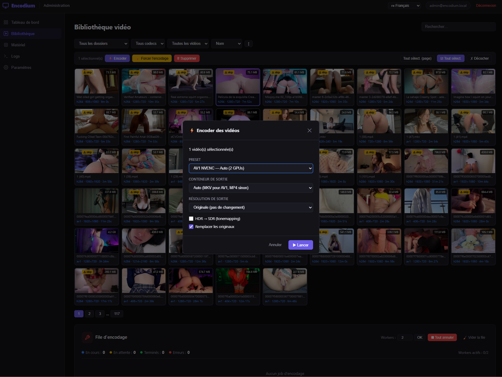
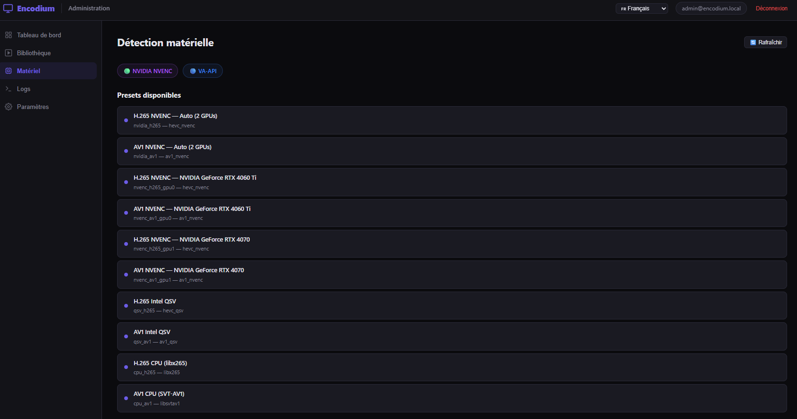
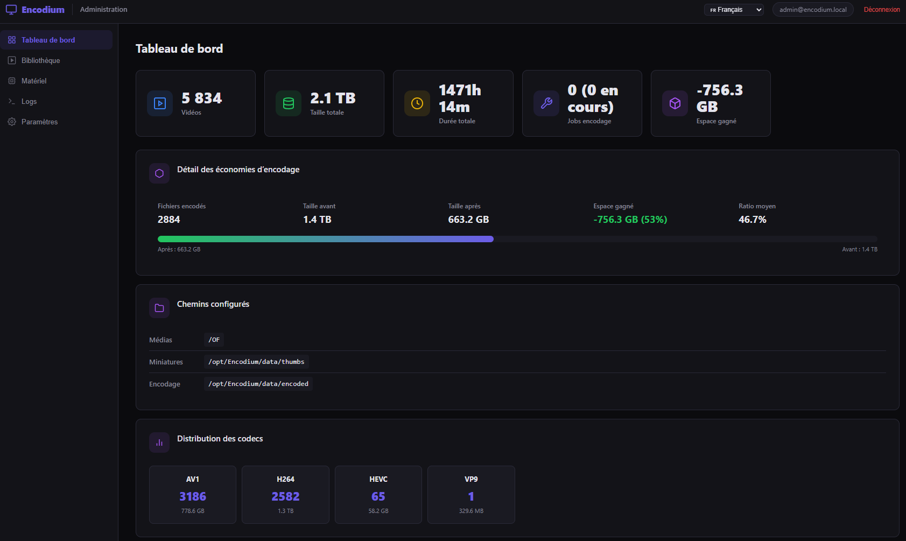

# Encodium

**Self-hosted video encoding platform** — scan, browse and batch-encode your video library with GPU-accelerated H.265/AV1 encoding.

   

---

## Screenshots

| Library | Hardware Detection |
|---|---|
|  |  |

| Queue & Encoding | Settings |
|---|---|
|  |  |

---

## Features

- **Multi-source library** — add directories via built-in file browser; `fs.watch` + configurable periodic sync
- **Hardware detection** — NVIDIA NVENC, AMD/Intel VA-API, Intel QSV, and CPU encoders
- **Multi-GPU load balancing** — automatic distribution across 2+ GPUs with per-device locking
- **Batch encoding** — select videos, pick a preset, encode; queue with priority, cancel, retry, reorder
- **HDR preservation** — 10-bit/HDR10 passthrough; optional tonemap to SDR
- **Size guard** — rejects encodes larger than the original; skip flag prevents re-encoding
- **CUDA VRAM decode** — `-hwaccel_output_format cuda` keeps decoded frames in GPU memory
- **GPU→CPU fallback** — automatic retry with software decode on hwaccel failure
- **Output validation** — codec, duration, and integrity checks after every encode
- **Crash recovery** — stalled jobs cancelled on restart; orphan ffmpeg killed; stale temps cleaned
- **SIGKILL protection** — max 3 retries with exponential backoff on OOM kills
- **Schedule window** — restrict encoding to a daily time range
- **Custom presets** — save reusable encoding profiles (codec, CQ, container, downscale, tonemap)
- **Webhook notifications** — Discord and generic HTTP at queue completion (SSRF-protected)
- **Real-time SSE** — live progress, queue updates, pipeline status; tab-aware refresh
- **Dashboard** — video count, total size, codec distribution, encoding savings charts
- **HTML5 streaming** — play videos directly from the library with HTTP range requests
- **On-demand thumbnails** — non-blocking generation with shimmer placeholder
- **14 languages** — EN, FR, DE, ES, IT, PT, NL, PL, RU, TR, AR, JA, KO, ZH
- **JWT authentication** — admin/member roles; rate-limited login
- **Frontend diagnostics** — `Ctrl+Shift+D` debug overlay; `_encodiumDebug()` in DevTools

---

## Requirements

| Component | Version |
|---|---|
| Node.js | 18+ (20 LTS recommended) |
| MariaDB | 10.6+ (or MySQL 8+) |
| ffmpeg | 6+ with ffprobe |
| GPU *(optional)* | NVIDIA + NVENC, AMD/Intel VA-API, or Intel QSV |

---

## Quick Start

### Bare metal

```bash
git clone https://github.com/HeartBtz/Encodium.git
cd Encodium
bash install.sh
```

The installer handles **everything** autonomously: Node.js, MariaDB, ffmpeg, npm deps, database, `.env`, admin account, and process manager (systemd on real hosts, PM2 in containers).

Open `http://localhost:4000`, log in with the credentials shown by the installer, then add your media directories via **Settings → Sources**.

### Docker

```bash
git clone https://github.com/HeartBtz/Encodium.git
cd Encodium
cp .env.example .env
# Edit .env → set DB_PASS (required) and JWT_SECRET (recommended)

docker compose up -d                         # CPU only
docker compose --profile gpu up -d           # NVIDIA GPU

# Create admin account
docker compose exec encodium node cli.js useradd admin@example.com yourpassword
```

### Manual

```bash
npm install

# Create database
mysql -u root -e "CREATE DATABASE encodium CHARACTER SET utf8mb4 COLLATE utf8mb4_unicode_ci;"
mysql -u root -e "CREATE USER 'encodium'@'localhost' IDENTIFIED BY 'yourpassword';"
mysql -u root -e "GRANT ALL ON encodium.* TO 'encodium'@'localhost'; FLUSH PRIVILEGES;"

cp .env.example .env   # Set DB_PASS and JWT_SECRET
node server.js
```

---

## Updating

```bash
cd /opt/Encodium    # or wherever you cloned it
git pull
npm install --production

# Restart via your process manager:
sudo systemctl restart encodium     # systemd
# or
pm2 restart encodium                # PM2
```

The install script is idempotent — `bash install.sh` also works for updates.

---

## Configuration

| Variable | Default | Description |
|---|---|---|
| `DB_PASS` | — | **Required.** Server refuses to start without it |
| `JWT_SECRET` | — | **Recommended.** Random ephemeral secret if unset (tokens invalidated on restart) |
| `DB_HOST` | `localhost` | MariaDB host |
| `DB_PORT` | `3306` | MariaDB port |
| `DB_USER` | `encodium` | Database user |
| `DB_NAME` | `encodium` | Database name |
| `NODE_ENV` | — | Set to `production` to hide error details |
| `PORT` | `4000` | HTTP server port |
| `ENCODE_DIR` | `./data/encoded` | Encoded output directory |
| `THUMB_DIR` | `./data/thumbs` | Thumbnail storage |
| `MAX_WORKERS` | `2` | Concurrent encoding workers (1–8) |
| `MEDIA_DIR` | — | *Legacy.* Auto-migrated as first source on boot. Use **Settings → Sources** |

---

## Process Management

The installer picks **one** process manager (never both):

| Environment | Manager | Commands |
|---|---|---|
| Real host (systemd available) | **systemd** *(preferred)* | `systemctl {status,restart,stop} encodium` / `journalctl -u encodium -f` |
| Container / WSL / no systemd | **PM2** *(fallback)* | `pm2 {status,logs,restart,stop} encodium` |

---

## CLI

```bash
node cli.js scan                             # Scan all sources + enrich metadata
node cli.js enrich                           # Re-run ffprobe extraction
node cli.js thumbs                           # Generate missing thumbnails
node cli.js clear                            # Clear all videos from DB
node cli.js stats                            # Show database statistics
node cli.js useradd <email> <pass> [role]    # Create user (admin|member)
```

---

## Architecture

```
Encodium/
├── server.js                # Express entry point, graceful shutdown
├── db.js                    # MariaDB schema, migrations, helpers
├── scanner.js               # Media scanner, metadata enrichment, sync
├── cli.js                   # CLI (scan, enrich, thumbs, stats, useradd)
├── install.sh               # Autonomous installer
├── ecosystem.config.js      # PM2 config (fallback for containers)
├── middleware/
│   └── auth.js              # JWT auth (sign, verify, requireAuth, requireAdmin)
├── services/
│   ├── encoder.js           # Queue processor, GPU allocation, retry logic
│   ├── ffprobe.js           # ffprobe wrapper & stream analysis
│   ├── ffmpeg-args.js       # ffmpeg argument builder (HW/SW paths)
│   ├── webhook.js           # Discord & HTTP webhook notifications
│   ├── watcher.js           # fs.watch + periodic sync + SSE pipeline
│   ├── gpu-detect.js        # Hardware detection (NVIDIA, VA-API, QSV, CPU)
│   └── logger.js            # Ring-buffer logging + SSE broadcast
├── routes/
│   └── api.js               # REST API endpoints
├── public/
│   ├── index.html           # SPA shell
│   ├── css/style.css        # Dark theme
│   ├── js/app.js            # Frontend application
│   ├── js/i18n.js           # i18n engine
│   └── lang/                # 14 language packs
├── Dockerfile               # Multi-stage Docker build
├── docker-compose.yml       # Docker Compose (CPU + GPU profiles)
└── data/
    ├── logs/                # Per-job ffmpeg logs
    ├── thumbs/              # Generated thumbnails
    └── encoded/             # Encoded output staging
```

---

## Database

| Table | Purpose |
|---|---|
| `users` | Authentication (bcrypt, admin/member roles) |
| `videos` | Scanned files & metadata (codec, resolution, HDR, skip flag) |
| `encode_jobs` | Queue & history (priority, progress, retry_count) |
| `settings` | Key-value config (schedule, webhook, autoscan) |
| `encoding_savings` | Permanent savings ledger |
| `custom_presets` | User-defined encoding presets |
| `media_sources` | Configured source directories |

Migrations run automatically on startup.

---

## Security

- **Helmet** — HTTP security headers
- **Rate limiting** — 1200 req/min on API; 10 req/15min on login
- **JWT auth** — all API routes require valid Bearer token
- **Admin-only guards** — destructive ops, source management, filesystem browse
- **Bcrypt** — password hashing (cost 10–12)
- **Parameterized SQL** — prepared statements everywhere
- **Input validation** — sort columns whitelisted, pagination coerced
- **Webhook SSRF protection** — private/internal IPs blocked
- **Error sanitization** — stack traces hidden in production
- **Graceful shutdown** — SIGTERM/SIGINT drain active jobs (8s timeout)

**Production hardening:**
- Set `NODE_ENV=production`
- Set a strong `JWT_SECRET` (≥ 32 chars)
- Run behind a reverse proxy (nginx/Caddy) with TLS
- Restrict MariaDB network access

---

## Supported Encoders

| Type | Encoders |
|---|---|
| NVIDIA NVENC | H.265, AV1 (multi-GPU) |
| AMD/Intel VA-API | H.265, AV1 (multi-device) |
| Intel QSV | H.265, AV1 |
| CPU | libx265, SVT-AV1, libaom-av1 |

---

<details>
<summary><strong>API Reference</strong></summary>

| Method | Path | Description |
|---|---|---|
| **Auth** | | |
| POST | `/api/auth/login` | Login (10 req/15min) |
| GET | `/api/auth/me` | Current user |
| **Scanner** | | |
| POST | `/api/scan` | Start media scan |
| GET | `/api/scan/progress` | Scan progress |
| POST | `/api/scan/cancel` | Cancel scan |
| POST | `/api/sync` | Sync (orphan removal + discovery) |
| GET | `/api/sync/progress` | Sync progress |
| POST | `/api/enrich` | Enrich metadata (ffprobe) |
| GET | `/api/enrich/progress` | Enrich progress |
| POST | `/api/thumbs` | Generate thumbnails |
| GET | `/api/thumbs/progress` | Thumbnails progress |
| **Videos** | | |
| GET | `/api/videos` | List / search / filter (paginated) |
| GET | `/api/videos/ids` | All IDs matching filters |
| GET | `/api/videos/:id` | Video details |
| POST | `/api/videos/delete` | Bulk delete (+ files) |
| POST | `/api/videos/clear-skip` | Clear skip flag |
| GET | `/api/folders` | Folder list |
| GET | `/api/codec-stats` | Codec distribution |
| GET | `/api/stats` | Dashboard stats |
| GET | `/api/stats/history` | Daily encoding history |
| GET | `/api/thumb/:id` | Thumbnail (on-demand) |
| GET | `/api/stream/:id` | Video stream (range) |
| **Encoding** | | |
| GET | `/api/encode/capabilities` | Hardware + presets |
| GET | `/api/encode/status` | Queue status |
| GET | `/api/encode/history` | Job history |
| POST | `/api/encode/enqueue` | Enqueue jobs |
| POST | `/api/encode/cancel/:id` | Cancel job |
| POST | `/api/encode/cancel-all` | Cancel all pending |
| POST | `/api/encode/clear-finished` | Clear finished jobs |
| POST | `/api/encode/retry/:id` | Retry failed job |
| DELETE | `/api/encode/job/:id` | Delete job |
| GET | `/api/encode/job/:id/log` | Job ffmpeg log |
| POST | `/api/encode/job/:id/priority` | Set priority |
| POST | `/api/encode/job/:id/move` | Reorder in queue |
| POST | `/api/encode/workers` | Set worker count |
| **Settings** | | |
| GET/POST | `/api/settings/sources` | Media sources CRUD |
| DELETE | `/api/settings/sources/:id` | Remove source |
| GET | `/api/browse` | Filesystem browser (admin) |
| GET/POST | `/api/settings/autoscan` | Auto-scan config |
| GET/POST | `/api/settings/schedule` | Schedule window |
| GET/POST | `/api/settings/notifications` | Webhook config |
| GET/POST/DELETE | `/api/custom-presets` | Custom presets |
| **Other** | | |
| GET | `/api/events` | SSE stream |
| GET | `/api/logs` | Application logs |
| POST | `/api/clear` | Clear database (admin) |

</details>

---

## Changelog

### v1.5.0

**Stability & Performance**
- **CUDA VRAM decode** — add `-hwaccel_output_format cuda` to keep decoded frames in GPU memory instead of copying to system RAM; prevents OOM kills on low-memory hosts
- **SIGKILL retry limits** — track `retry_count` per job; max 3 retries with exponential backoff (10s/20s/40s) on SIGKILL; stops infinite restart loops
- **GPU device isolation** — `CUDA_VISIBLE_DEVICES` handles physical→logical GPU mapping; `-hwaccel_device` always `0` within the isolated context
- **Boot order fix** — `app.listen()` runs **before** `encoder.start()` so a port conflict fails fast without killing active jobs
- **EADDRINUSE handling** — clear error message and clean exit instead of silent crash loop
- **Reduced memory footprint** — `probesize`/`analyzeduration` lowered from 50M to 20M

**Process Management**
- **Single process manager** — installer picks systemd (preferred) or PM2 (fallback), never both; eliminates dual-manager conflicts
- **systemd preferred** — on real hosts with systemd, PM2 instance is cleaned up automatically

**Refactoring**
- Extracted `ffprobe.js`, `ffmpeg-args.js`, `webhook.js` from monolithic encoder
- Fixed all 42 empty catch blocks across the codebase
- Full code quality audit: race conditions, error handling, SSE reliability

**Bug Fixes**
- `clearFinished` — clear button now removes done/error/cancelled jobs correctly
- `enqueueBatch` — duplicate prevention and skip-flag check fixed
- Progress throttle — SSE updates capped at 1/s per job to reduce browser load
- Library refresh — auto-refresh after scan/enrich pipeline completes
- i18n — missing keys and plural forms corrected
- Logging — structured log levels, no more swallowed errors

### v1.4.1
- Non-blocking thumbnail endpoint (HTTP 202 + background generation)
- Skeleton shimmer loader with retry backoff
- Proxy CORS auto-reload detection
- Rate limit raised to 1200 req/min; thumbnails & SSE excluded
- Reduced API flooding (30s poll, deduplicated SSE reconnect)
- Frontend network diagnostics (`Ctrl+Shift+D`, console logging)
- SSE reconnect scoped to active tab only

### v1.4.0
- Multi-source media directories with file browser UI
- Auto-scan pipeline (`fs.watch` + periodic sync)
- SSE pipeline events for auto-refresh
- Source purge (removes indexed videos + thumbnails)
- Admin-only guards on destructive operations
- 14 languages for all new features
- CLI improvements (fixed DB pool leak, source-aware scan)

### v1.3.0
- Server-side queue counts via SQL aggregation
- Encoding jobs always visible regardless of pagination
- Truncated pagination with ellipsis
- SSRF protection (link-local + IPv6 ULA blocked)
- Scanner default path fix

### v1.2.0
- Skip filter, i18n (14 languages), security audit fixes
- ENOENT retry logic, crash recovery, PM2 optimization
- Graceful shutdown with memory diagnostics

---

## License

MIT
